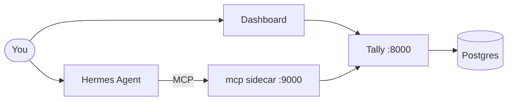

# Tally — personal expense & cash tracker

> *Your money, counted.* A self-hosted FastAPI app that replaces the spreadsheet.
> Dashboard, natural-language logging, multi-currency FX, recurring charges,
> and an MCP sidecar so your AI agent can log expenses too.

Runs on your own machine, backed by your own Postgres, accessible only over
Tailscale. No SaaS, no sharing, no ads.



## What it tracks

Two kinds of money data, kept in sync automatically:

- **Balances** — how much you have *right now* per account (stocks)
- **Transactions** — where money went or came from (flows)

Log a transaction → the latest balance auto-adjusts. Capture a manual balance →
it becomes the new baseline. No reconciling.

Transactions use three flows: `expense`, `income`, or `transfer`. The dashboard
spend totals only count `expense` — so CC payments and account-to-account
transfers (use `transfer`) never inflate your spending.

## Quick start

```bash
# 1. Postgres (separate host, reachable over Tailscale)
createdb expenses

# 2. Clone, configure, launch
git clone https://github.com/chiam-ck/tally-expenses.git
cd tally-expenses
cp .env.example .env   # edit: DATABASE_URL, API_KEY, auth creds
docker compose up -d
```

Open `http://<your-host>:8000` from any Tailscale device. Point your phone at
it → Add to Home Screen for an app-like icon.

## Stack

Python 3.12 · FastAPI + Uvicorn · psycopg 3 · Jinja2 · APScheduler · httpx
All charts are dependency-free server-rendered SVG. Timezone: Asia/Singapore.

## API at a glance

| Endpoint | What it does |
|---|---|
| `GET /` | Dashboard: liquid cash, spend donut, daily bars, burn rate, projection |
| `GET /history` | Browse & filter all transactions with pagination |
| `POST /api/parse` | "grab to airport 24" → structured fields (LLM + regex fallback) |
| `POST /api/txn` | Record a transaction (`expense` / `income` / `transfer`) |
| `DELETE /api/txn/{id}` | Undo a mistaken log |
| `POST /api/balance` | Capture today's account balances |
| `GET /api/dashboard` | All dashboard metrics as JSON |
| `GET /api/reference` | Live accounts, categories, currencies (for agents) |
| `GET /api/transactions` | Filtered list with `expense_total_sgd` |
| `GET /api/fx` | Exchange rates (`to_sgd` per currency) |

All `/api/*` routes accept `Authorization: Bearer <API_KEY>` for programmatic
access — no login cookie needed.

## Scheduled jobs

| Job | When | Does |
|---|---|---|
| Recurring poster | Daily 00:10 | Posts due subscriptions/bills to transactions |
|                  |             | Optionally notifies via Discord webhook (`DISCORD_RECURRING_WEBHOOK`) |
| Monthly rollover | 1st, 00:05 | Carries latest balances forward to the new month |
| FX update | Daily 00:20 | Fetches live rates from open.er-api.com |
| Weekly digest | Mon 07:00 | Emails a dashboard summary via Resend (optional) |

All idempotent. All fail-soft — a dead FX source keeps the last known rates.

## Agent access (MCP)

The `tally-mcp` sidecar exposes every API endpoint as MCP tools so your AI
agent (Hermes, Claude, etc.) can read and write your finances:

`get_dashboard` · `list_reference` · `list_transactions` · `get_fx_rates`
`parse_expense` · `log_transaction` · `log_from_text` · `delete_transaction`
`set_balance`

Agents authenticate with `MCP_AUTH_TOKEN`; the sidecar holds the API key
internally. Two distinct secrets, no key leakage.

## Security

- **Tailscale-only** — no public exposure (Serve, never Funnel)
- **Login gate** — single-user HMAC-signed cookie for browser access
- **API key** — Bearer token for programmatic `/api/*` access
- **MCP token** — separate gate for the agent sidecar
- **Parameterized SQL** — no string interpolation into queries
- **Write validation** — account/category checked against DB on every write

## Docs

- [`ARCHITECTURE.md`](ARCHITECTURE.md) — system design, request flows, trust boundaries
- [`SEMANTIC_LAYER.md`](SEMANTIC_LAYER.md) — domain model for AI agents
- [`SPEC.md`](SPEC.md) — original build spec

## License

[MIT](LICENSE) © 2026 Ck Chiam
